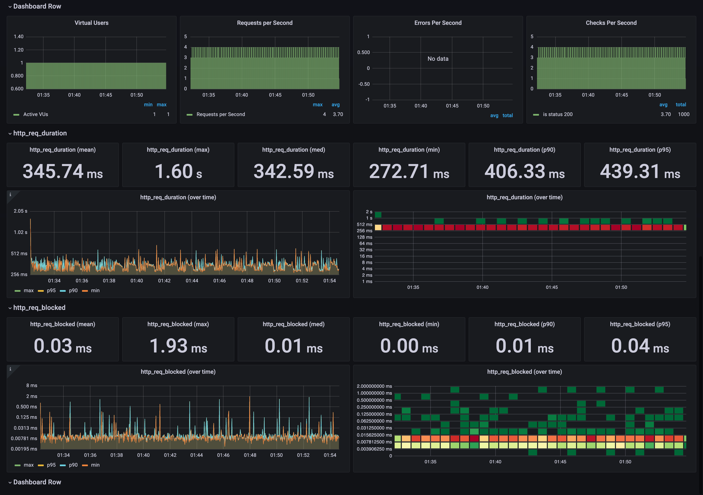

# To-do list

This is a simple gRPC app.

## Docker compose

Run the following script to start the containers:

```bash
./start.sh
```

Run the following script to run load tests:

```bash
./test.sh
```

Also, you can use the following script to stop the containers:

```bash
./stop.sh
```

With the following script you can clear all and stop the containers:

```bash
./stop-clear.sh
```

Finally, you can use the following script to see the containers:

```bash
./show-containers.sh
```

## Install bloomrpc

Download and install from [https://github.com/bloomrpc/bloomrpc](https://github.com/bloomrpc/bloomrpc)

## Install evans

Download and install from [https://github.com/ktr0731/evans/releases](https://github.com/ktr0731/evans/releases)

## Install protoc

Download and install from [https://github.com/protocolbuffers/protobuf/releases](https://github.com/protocolbuffers/protobuf/releases)

## Generate protobuf files 

Run the following command to generate code of categories.proto and tasks.proto:

```bash
mkdir java
```

```bash
protoc -I=. --java_out=java categories.proto tasks.proto 
```

If you want to generate code with the IntelliJ IDEA, run the following task:

```
categories -> other -> generateProto
```

```
tasks -> other -> generateProto
```

In the case of JavaScript run the script:

```
./generate-proto.sh
```

## pgAdmin

You can import the data from the `microservices/tasks-tb.csv` file:

- Open pgAdmin on [localhost:80](http://localhost:80) and login with `pg@domain.com` user and `secret` password
- Copy an id from the categories table
- Rename the id of the second column of the `microservices/tasks-tb.csv` file
- Copy the `microservices/tasks-tb.csv` file to `pgadmin/storage/pg_domain.com` directory
- Import the file, we recommend testing only with 100 records

## Test REST APIs

Show all categories:

```bash
curl 'localhost:8080/api/v1/categories'
```

Create a new task:

```bash
curl -v -X POST 'localhost:8081/api/v1/tasks' -H 'Content-Type: application/json' -d '{"name": "my category", "categoryId": "00000000-0000-0000-0000-000000000000"}'
```

Update a task:

```bash
curl -v -X PUT 'localhost:8081/api/v1/tasks/00000000-0000-0000-0000-000000000000' -H 'Content-Type: application/json' -d '{"name": "my category", "categoryId": "00000000-0000-0000-0000-000000000000"}'
```

Delete a task:

```bash
curl -v -X DELETE 'localhost:8081/api/v1/tasks/00000000-0000-0000-0000-000000000000'
```

Show tasks by category:

```bash
curl 'localhost:8081/api/v1/tasks?categoryId=00000000-0000-0000-0000-000000000000'
```

Pagination of tasks by category

```bash
curl 'localhost:8081/api/v1/tasks?categoryId=00000000-0000-0000-0000-000000000000&page=0&size=10'
```

Count tasks by category:

```bash
curl 'localhost:8081/api/v1/tasks/count?categoryId=00000000-0000-0000-0000-000000000000'
```

## Test gRPC APIs

Connect to the category server:

```bash
evans --host localhost --port 50050 --reflection repl
```

```bash
show service
```

Show all categories:

```bash
call listCategories
```

Connect to the task server:

```bash
evans --host localhost --port 50051 --reflection repl
```

```bash
show service
```

Create a new task:

```bash
call createTask
```

Update a task:

```bash
call updateTask
```

Delete a task:

```bash
call deleteTask
```

Show tasks by category:

```bash
call listTasks
```

Count tasks by category:

```bash
call countTasks
```

## REST API vs gRPC

Run the following script to run load tests, this need a category id as argument:

```bash
./test.sh 00000000-0000-0000-0000-000000000000
```

```bash
==> Using GET /api/v1/tasks to get all tasks
==> Make secure that you import the file: microservices/tasks-tb.csv
==> Starting at time: Fri Jul  8 01:32:13 WEST 2022

          /\      |‾‾| /‾‾/   /‾‾/
     /\  /  \     |  |/  /   /  /
    /  \/    \    |     (   /   ‾‾\
   /          \   |  |\  \ |  (‾)  |
  / __________ \  |__| \__\ \_____/ .io

  execution: local
     script: /k6/list_tasks_test.js
     output: InfluxDBv1 (http://192.168.1.136:8086)

  scenarios: (100.00%) 1 scenario, 1 max VUs, 30m30s max duration (incl. graceful stop):
           * default: 1000 iterations shared among 1 VUs (maxDuration: 30m0s, gracefulStop: 30s)


running (22m26.8s), 0/1 VUs, 1000 complete and 0 interrupted iterations
default ✓ [======================================] 1 VUs  22m27.8s/30m0s  1000/1000 shared iters

     █ GET List Tasks

       ✓ is status 200

     checks.........................: 100.00% ✓ 1000     ✗ 0
     data_received..................: 13 GB   9.5 MB/s
     data_sent......................: 93 kB   69 B/s
     group_duration.................: avg=1.34s    min=1.27s    med=1.34s    max=2.61s    p(90)=1.4s     p(95)=1.44s
     http_req_blocked...............: avg=25.82µs  min=2.78µs   med=9.64µs   max=1.92ms   p(90)=14.67µs  p(95)=38µs
     http_req_connecting............: avg=9.29µs   min=0s       med=0s       max=1.76ms   p(90)=0s       p(95)=0s
     http_req_duration..............: avg=345.74ms min=272.71ms med=342.58ms max=1.59s    p(90)=406.42ms p(95)=439.37ms
       { expected_response:true }...: avg=345.74ms min=272.71ms med=342.58ms max=1.59s    p(90)=406.42ms p(95)=439.37ms
     http_req_failed................: 0.00%   ✓ 0        ✗ 1000
     http_req_receiving.............: avg=95.17ms  min=67.11ms  med=89.56ms  max=238.89ms p(90)=120.67ms p(95)=131.31ms
     http_req_sending...............: avg=81.59µs  min=11.97µs  med=47.16µs  max=759.24µs p(90)=175.57µs p(95)=249.81µs
     http_req_tls_handshaking.......: avg=0s       min=0s       med=0s       max=0s       p(90)=0s       p(95)=0s
     http_req_waiting...............: avg=250.48ms min=181.5ms  med=253.37ms max=1.35s    p(90)=307.07ms p(95)=336.07ms
     http_reqs......................: 1000    0.742523/s
     iteration_duration.............: avg=1.34s    min=1.27s    med=1.34s    max=2.62s    p(90)=1.4s     p(95)=1.44s
     iterations.....................: 1000    0.742523/s
     vus............................: 1       min=1      max=1
     vus_max........................: 1       min=1      max=1

==> Open Grafana to see the results: http://localhost:3000
==> Ended at time: Fri Jul  8 01:54:42 WEST 2022
==> Execution time: 22 minutes and 29 seconds
Press ENTER to continue...
==> Using gRPC listTasks to get all tasks
==> Make secure that you import the file: microservices/task-tb.csv
==> Starting at time: Fri Jul  8 01:56:56 WEST 2022
==> Open the HTML file to see the results: test/ghz-gRPC.html
==> Ended at time: Fri Jul  8 02:04:46 WEST 2022
==> Execution time: 7 minutes and 50 seconds
```

<details>
  <summary>Click here to see the REST API results</summary>
  
</details>

Open the HTML `test/ghz-gRPC.html` file in the browser to see the gRPC results.
